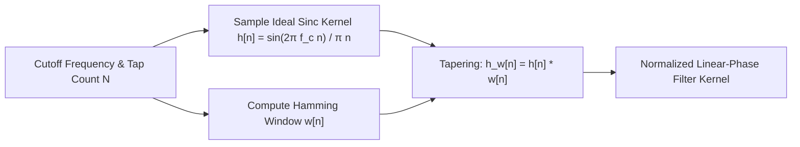

# Windowed-Sinc FIR Filter Design Skill

Exact linear-phase Finite Impulse Response (FIR) digital filter synthesis utilizing the windowed sinc method with Hamming window attenuation.

## Features
- **100% Python Standard Library**: Analytical trigonometric kernel generation.
- **Strict Linear Phase**: Constant group delay across all passband frequencies.
